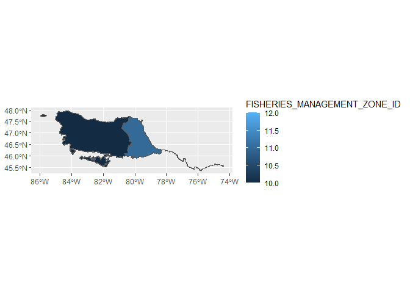
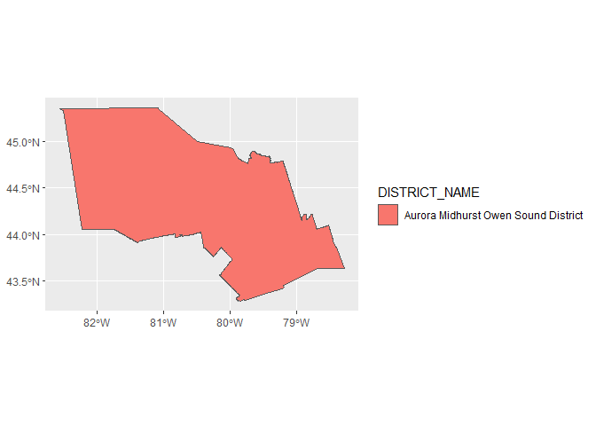
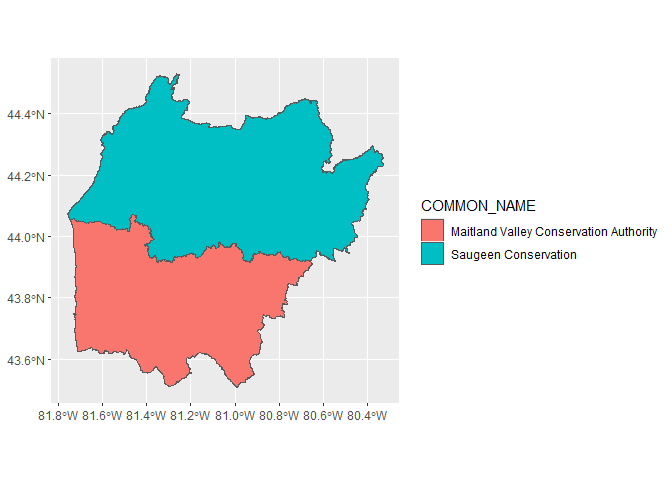
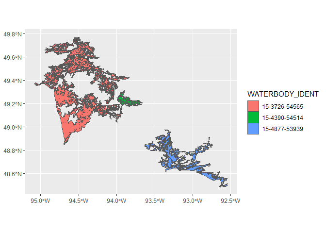
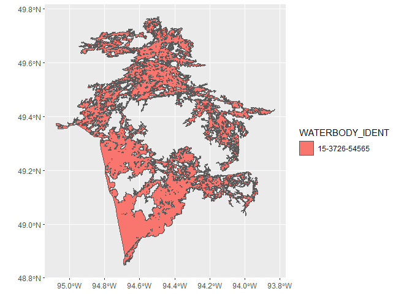
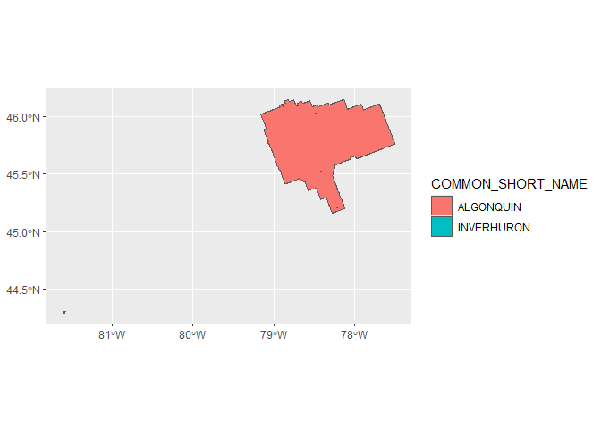
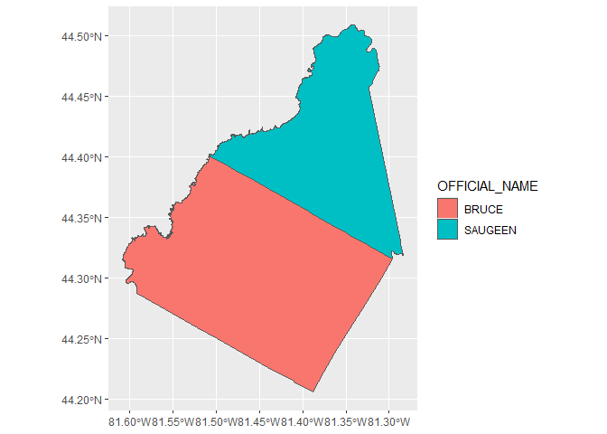

<!-- README.md is generated from README.Rmd. Please edit that file -->

# OntarioGeoHubR

An R package that will make it easy to fetch resources from Ontario
geohub and pull them into R for subsequent analysis and reporting.
Currently supported endpoints include:

- Fisheries Management Zones
- MNR Districts
- Conservation Authorities
- Waterbodies
- Provincial Parks
- Townships

More endpoints and improved filters can be added in the future.

The functions in the package do not perform any calculations, they
simply fetch the data from the specified endpoint and can be thought of
as a short cut for manually access geohub, downloading the resources and
reading the files in.

``` r
# ggplot2 isn't required, but used here for plotting.

library(ggplot2)
```

    ## Warning: package 'ggplot2' was built under R version 4.4.3

``` r
library(OntarioGeohubR)
```

# Fisheries Management Zones

Fisheries Management Zones are the main spatial unit used by the Ontario
Ministry of Natural Resource to manage fisheries resources across the
province.

the function `fetch_fmz()` can be used to retrieved one or more
fisheries management units and return them as a sf (simple feature)
which can then be used for plotting or subsequent analysis.

``` r
fmz <- fetch_fmz(10)
unique(fmz$FISHERIES_MANAGEMENT_ZONE_ID)
```

    ## [1] 10

``` r
fmz <- fetch_fmz(c(10, 11, 12))
unique(fmz$FISHERIES_MANAGEMENT_ZONE_ID)
```

    ## [1] 12 10 11

``` r
my_plot <- ggplot2::ggplot() +
  ggplot2::geom_sf(data = fmz, aes(fill = FISHERIES_MANAGEMENT_ZONE_ID))
print(my_plot)
```

<!-- -->

# MNR Districts

MNR Districts divide the Regions of the province into smaller
organizational units for the purpose of managing Ministry programs and
resources at a district level.

The function `fetch_mnr_district()` can be used to retrieved one or more
districts that match a string (or vector of strings).

``` r
dist <- fetch_mnr_district(name_like = "Aurora")
unique(dist$DISTRICT_NAME)
```

    ## [1] "Aurora Midhurst Owen Sound District"

``` r
dist <- fetch_mnr_district(name_like = c("Aurora", "Owen Sound"))
unique(dist$DISTRICT_NAME)
```

    ## [1] "Aurora Midhurst Owen Sound District"

``` r
my_plot <- ggplot2::ggplot() +
  ggplot2::geom_sf(data = dist, aes(fill = DISTRICT_NAME))
print(my_plot)
```

<!-- -->

# Conservation Authorities

The function `fetch_conservation_authority()` accesses the geohub
endpoint for conservation authority administrative areas and returns
geometries that represent lands under the jurisdiction of a Conservation
Authority. The function `fetch_conservation_authority()` can be given a
string or a vector of strings and will return conservation area
object(s) with names that match.

``` r
ca <- fetch_conservation_authority(name_like = "Saugeen")
unique(ca$COMMON_NAME)
```

    ## [1] "Saugeen Conservation"

``` r
ca <- fetch_conservation_authority(name_like = c("Saugeen", "Maitland"))
unique(ca$COMMON_NAME)
```

    ## [1] "Maitland Valley Conservation Authority"
    ## [2] "Saugeen Conservation"

``` r
my_plot <- ggplot2::ggplot() +
  ggplot2::geom_sf(data = ca, aes(fill = COMMON_NAME))
print(my_plot)
```

<!-- -->

# Waterbodies

The function `fetch_waterbody()` accesses the geohub endpoint ‘Ontario
waterbody location identifier’ which represents unique Ontario waterbody
location identification information. The function `fetch_waterbody()`
can be used to retrieve waterbodies by Waterbody Identifier or partial
matches to various name fields.

``` r
wby <- fetch_waterbody(name_like = "Lake of the")
print(
  wby[
    ,
    c(
      "WATERBODY_IDENT",
      "OFFICIAL_NAME",
      "WATERBODY_IDENT",
      "UNOFFICIAL_NAME",
      "OFFICIAL_ALTERNATE_NAME",
      "EQUIVALENT_FRENCH_NAME"
    )
  ]
)
```

    ## Simple feature collection with 7 features and 6 fields
    ## Geometry type: GEOMETRY
    ## Dimension:     XY
    ## Bounding box:  xmin: -95.07566 ymin: 44.34254 xmax: -75.94861 ymax: 49.77069
    ## Geodetic CRS:  WGS 84
    ##   WATERBODY_IDENT         OFFICIAL_NAME WATERBODY_IDENT.1 UNOFFICIAL_NAME
    ## 1   15-3911-54691      Lake of the Bays     15-3911-54691            <NA>
    ## 2   17-4463-51322 Lake of the Mountains     17-4463-51322            <NA>
    ## 3   18-3445-50161     Lake of the Hills     18-3445-50161            <NA>
    ## 4   17-4845-51050     Lake of the Woods     17-4845-51050            <NA>
    ## 5   18-3773-49580     Lake of the Hills     18-3773-49580            <NA>
    ## 6   18-4229-49091     Lake of the Isles     18-4229-49091            <NA>
    ## 7   15-3726-54565     Lake of the Woods     15-3726-54565            <NA>
    ##   OFFICIAL_ALTERNATE_NAME EQUIVALENT_FRENCH_NAME                       geometry
    ## 1                    <NA>       Lake of the Bays MULTIPOLYGON (((-94.50013 4...
    ## 2                    <NA>  Lake of the Mountains POLYGON ((-81.69381 46.3453...
    ## 3                    <NA>      Lake of the Hills POLYGON ((-76.97788 45.2868...
    ## 4                    <NA>      Lake of the Woods POLYGON ((-81.20571 46.1021...
    ## 5                    <NA>      Lake of the Hills POLYGON ((-76.552 44.76174,...
    ## 6                    <NA>      Lake of the Isles POLYGON ((-75.95064 44.3497...
    ## 7            lac des Bois                   <NA> POLYGON ((-95.07566 49.3717...

``` r
wby <- fetch_waterbody(name_like = c("Saugeen", "Bruce"))

print(
  wby[
    ,
    c(
      "WATERBODY_IDENT",
      "OFFICIAL_NAME",
      "WATERBODY_IDENT",
      "UNOFFICIAL_NAME",
      "OFFICIAL_ALTERNATE_NAME",
      "EQUIVALENT_FRENCH_NAME"
    )
  ]
)
```

    ## Simple feature collection with 7 features and 6 fields
    ## Geometry type: GEOMETRY
    ## Dimension:     XY
    ## Bounding box:  xmin: -81.37382 ymin: 43.95413 xmax: -79.51786 ymax: 48.81057
    ## Geodetic CRS:  WGS 84
    ##   WATERBODY_IDENT                OFFICIAL_NAME WATERBODY_IDENT.1
    ## 1   17-4709-49273                Saugeen River     17-4709-49273
    ## 2   17-5093-48939          Rocky Saugeen River     17-5093-48939
    ## 3   17-4979-48866         Beatty Saugeen River     17-4979-48866
    ## 4   17-6065-54060                Saugeen Creek     17-6065-54060
    ## 5   17-4973-48883          South Saugeen River     17-4973-48883
    ## 6   17-5267-49065 West Arm Rocky Saugeen River     17-5267-49065
    ## 7   17-4787-49069          North Saugeen River     17-4787-49069
    ##   UNOFFICIAL_NAME OFFICIAL_ALTERNATE_NAME
    ## 1            <NA>                    <NA>
    ## 2            <NA>                    <NA>
    ## 3            <NA>                    <NA>
    ## 4            <NA>                    <NA>
    ## 5            <NA>                    <NA>
    ## 6            <NA>                    <NA>
    ## 7            <NA>                    <NA>
    ##                   EQUIVALENT_FRENCH_NAME                       geometry
    ## 1                        rivière Saugeen MULTIPOLYGON (((-81.34123 4...
    ## 2                  rivière Rocky Saugeen MULTIPOLYGON (((-80.66386 4...
    ## 3                 rivière Beatty Saugeen MULTIPOLYGON (((-81.00437 4...
    ## 4                       ruisseau Saugeen POLYGON ((-79.54293 48.8078...
    ## 5                    rivière Saugeen Sud MULTIPOLYGON (((-80.47771 4...
    ## 6 bras Ouest de la rivière Rocky Saugeen POLYGON ((-80.66452 44.3134...
    ## 7                   rivière Saugeen Nord MULTIPOLYGON (((-81.25838 4...

``` r
my_plot <- ggplot2::ggplot() +
  ggplot2::geom_sf(data = wby, aes(fill = WATERBODY_IDENT))
print(my_plot)
```

<!-- -->

``` r
wby <- fetch_waterbody(wbylid = "15-3726-54565")
print(
  wby[
    ,
    c(
      "WATERBODY_IDENT",
      "OFFICIAL_NAME",
      "WATERBODY_IDENT",
      "UNOFFICIAL_NAME",
      "OFFICIAL_ALTERNATE_NAME",
      "EQUIVALENT_FRENCH_NAME"
    )
  ]
)
```

    ## Simple feature collection with 1 feature and 6 fields
    ## Geometry type: POLYGON
    ## Dimension:     XY
    ## Bounding box:  xmin: -95.07566 ymin: 48.84562 xmax: -93.82818 ymax: 49.77069
    ## Geodetic CRS:  WGS 84
    ##   WATERBODY_IDENT     OFFICIAL_NAME WATERBODY_IDENT.1 UNOFFICIAL_NAME
    ## 1   15-3726-54565 Lake of the Woods     15-3726-54565            <NA>
    ##   OFFICIAL_ALTERNATE_NAME EQUIVALENT_FRENCH_NAME                       geometry
    ## 1            lac des Bois                   <NA> POLYGON ((-95.07566 49.3717...

``` r
# Lake of the Woods and Slippery Lake (to the north west of LOW)
wby <- fetch_waterbody(wbylid = c("15-3726-54565", "15-3726-54565"))
print(
  wby[
    ,
    c(
      "WATERBODY_IDENT",
      "OFFICIAL_NAME",
      "WATERBODY_IDENT",
      "UNOFFICIAL_NAME",
      "OFFICIAL_ALTERNATE_NAME",
      "EQUIVALENT_FRENCH_NAME"
    )
  ]
)
```

    ## Simple feature collection with 1 feature and 6 fields
    ## Geometry type: POLYGON
    ## Dimension:     XY
    ## Bounding box:  xmin: -95.07566 ymin: 48.84562 xmax: -93.82818 ymax: 49.77069
    ## Geodetic CRS:  WGS 84
    ##   WATERBODY_IDENT     OFFICIAL_NAME WATERBODY_IDENT.1 UNOFFICIAL_NAME
    ## 1   15-3726-54565 Lake of the Woods     15-3726-54565            <NA>
    ##   OFFICIAL_ALTERNATE_NAME EQUIVALENT_FRENCH_NAME                       geometry
    ## 1            lac des Bois                   <NA> POLYGON ((-95.07566 49.3717...

``` r
my_plot <- ggplot2::ggplot() +
  ggplot2::geom_sf(data = wby, aes(fill = WATERBODY_IDENT))
print(my_plot)
```

<!-- -->

# Provincial Parks

Areas regulated under the provincial Parks Act (2006) can be retrieved
using the function `fetch_provincial_parks()`. This function can be
given a string or a vector of strings and will return parks with names
that match those strings

``` r
ppark <- fetch_provincial_park(name_like = "Algonquin")
unique(ppark$COMMON_SHORT_NAME)
```

    ## [1] "ALGONQUIN"

``` r
ppark <- fetch_provincial_park(name_like = c("Algonquin", "Inverhuron"))
unique(ppark$COMMON_SHORT_NAME)
```

    ## [1] "INVERHURON  " "ALGONQUIN"

``` r
my_plot <- ggplot2::ggplot() +
  ggplot2::geom_sf(data = ppark, aes(fill = COMMON_SHORT_NAME))
print(my_plot)
```

<!-- -->

# Townships

Townships are the fundamental land subdivision for the province of
Ontario. The function `fetch_township()` can be given a string or a
vector of strings and will return township object with names that match.

``` r
twnshp <- fetch_township(name_like = "Saugeen")
unique(twnshp$OFFICIAL_NAME)
```

    ## [1] "SAUGEEN"

``` r
twnshp <- fetch_township(name_like = c("Saugeen", "Bruce"))
unique(twnshp$OFFICIAL_NAME)
```

    ## [1] "BRUCE"   "SAUGEEN"

``` r
my_plot <- ggplot2::ggplot() +
  ggplot2::geom_sf(data = twnshp, aes(fill = OFFICIAL_NAME))
print(my_plot)
```

<!-- -->
